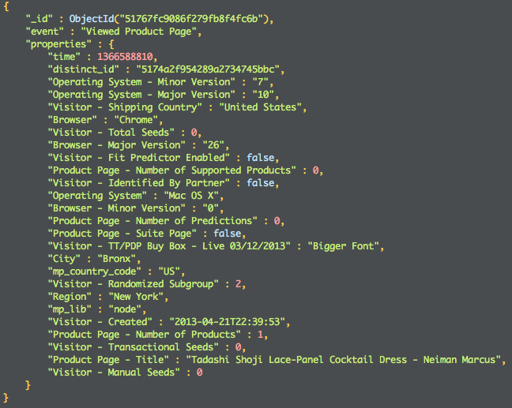

!SLIDE bullets incremental
# MongoDB #

* document store (semi-structured BSON)
* ad-hoc queries (JavaScript)
* primary and secondary indexes
* replica sets & sharding
* batch processing (MR & aggregation)

!SLIDE center gray
# Example Document

