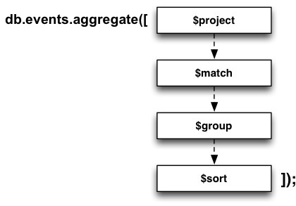

!SLIDE smbullets incremental

## After 2.2 (Aggregation Framework) #

* data pipeline
* pipeline operators
* condition operators ($match, $limit, $skip)
* reshaping operators ($project, $unwind)
* aggregating operators ($group)
* expressions ($sum, $avg, $min/max, etc.)
* 
